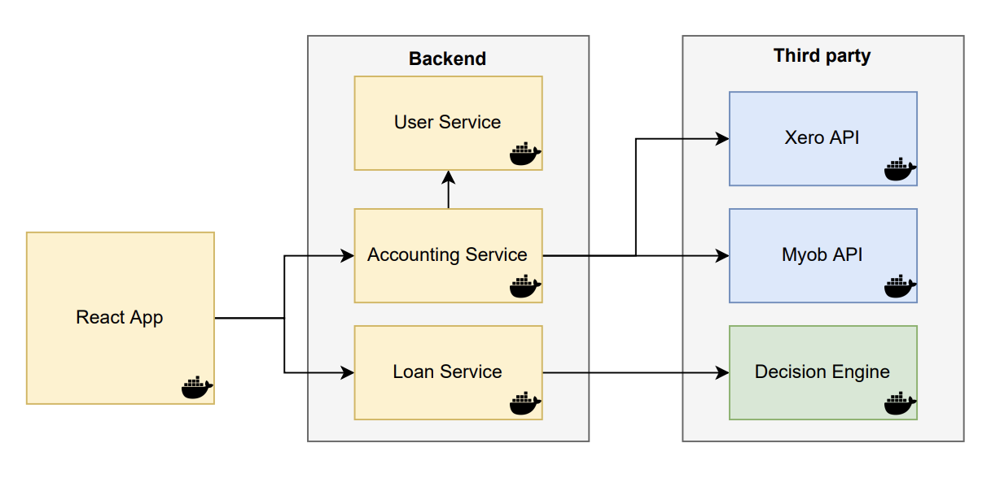

# Demyst Loan Application

This application is designed for Demyst code-kata challenge.

The purpose of the application is to allow users to apply for business loans. 

A user can enter their business details, which are used to get the balance sheet from a third party accounting provider such as Xero or MYOB.
The retrieved information is then used by the third party decision engine to asses the outcome for the loan application.

## Application Structure

The application contains the following components:

1. Frontend app build using React
2. Backend made of Python Flask microservices
3. Mock third party services made with Python Flask framework



### Frontend

The frontend is built using React and Ant Design.

### Backend

The backend contains 3 microservices:

1. User service - manages user data such as getting user id
2. Accounting service - connects to third party accounting providers to obtain balance sheet for the user
3. Loan service - connects with third party decision engine to obtain application outcome

### Third party providers

These mocked services portray the behaviour of intended third parties.

1. Decision engine - service that generates application outcome based on supplied data
2. Accounting provider APIs - returns balance sheet data for the user. Services for XERO and MYOB are mocked as examples. 

## Running the Application

### Prerequisites

1. Install [Docker](https://www.docker.com/) on your machine.
2. Clone the project.

### Run the program

If building for the first time:

```
docker compose build
```

Run the application:

```
docker compose up
```

## Future improvements

Several features and improvements can be done in future to enhance the project structure and features.

1. Use an event-driven architecture using a message queue or Kafka to reduce coupling among microservices
2. Use flask-marshmallow to map object models between frontend and backend.
3. Add testing to verify application processes.
4. Use Json files as a simple data store.